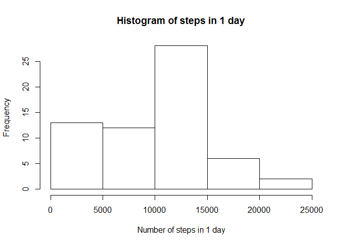
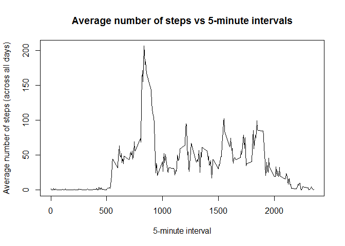
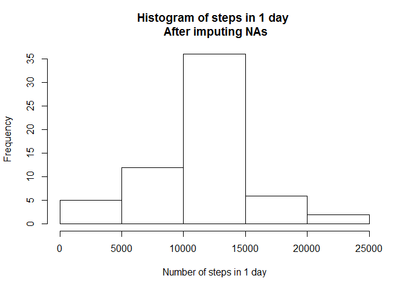
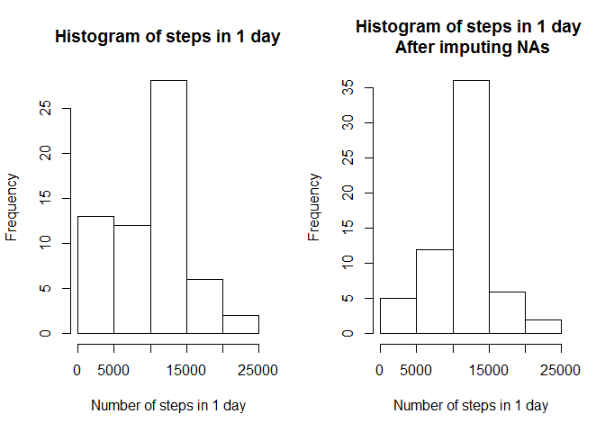
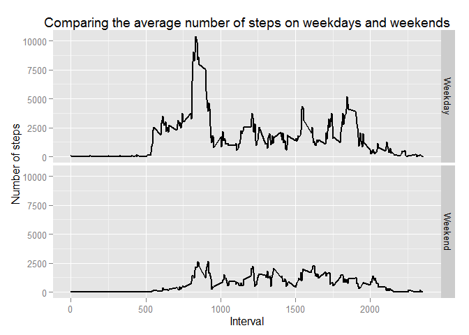

# Reproducible Research: Peer Assessment 1

## Loading and preprocessing the data

Since the data is in a zipped file, we need to use the unz function to access 
the csv file. We will also load in the dplyr package.


```r
library(dplyr)
```

```
## 
## Attaching package: 'dplyr'
## 
## The following objects are masked from 'package:stats':
## 
##     filter, lag
## 
## The following objects are masked from 'package:base':
## 
##     intersect, setdiff, setequal, union
```

```r
activity <- read.csv(unz("activity.zip", 
                   "activity.csv"))
```

## What is mean total number of steps taken per day?


```r
total_steps_per_day <- activity %>%
  group_by(date) %>%
  summarize(steps = sum(steps, 
                        na.rm = TRUE))

hist(total_steps_per_day$steps,
     xlab = "Number of steps in 1 day",
     main = "Histogram of steps in 1 day")
```

 

```r
mean_steps   <- round(mean(total_steps_per_day$steps))
median_steps <- median(total_steps_per_day$steps)
```

The mean total number of steps taken per day is `mean_steps`.
The median total number of steps taken per day is `median_steps`.

## What is the average daily activity pattern?


```r
avg_steps_per_interval <- activity %>%
  group_by(interval) %>%
  summarize(steps = mean(steps, 
                         na.rm = TRUE))

with(avg_steps_per_interval,
     plot(interval, 
          steps, 
          type = "l",
          xlab = "5-minute interval",
          ylab = "Average number of steps (across all days)",
          main = "Average number of steps vs 5-minute intervals"))
```

 

```r
interval_with_max_steps <- avg_steps_per_interval$interval[which.max(avg_steps_per_interval$steps)]
```

The 5-minute interval (on average across all the days in the dataset) that 
contains the maximum number of steps is `interval_with_max_steps`.

## Imputing missing values

How many rows have NAs?


There are `total_missing` missing values in the dataset.

We will now devise a strategy for filling in all of the missing values in the dataset. 

Using the day average to impute values doesn't work, because some days are full
of NAs (the first day in the dataset, for example). Instead, let's use the interval
average, which we have already calculated.


```r
activity2 <- activity

for (i in 1:nrow(activity2)) {
  
  if (is.na(activity2$steps[i])) {
    
    activity2$steps[i] <- avg_steps_per_interval %>%
      filter(interval == activity2$interval[i]) %>%
      select(steps)
  }
}
```

We will now make a histogram of the total number of steps taken each day,
and report the mean and median of the total number of steps taken per day.


```r
imputed_total_steps_per_day <- activity2 %>%
  group_by(date) %>%
  summarize(steps = sum(as.numeric(steps), 
                        na.rm = TRUE))

hist(imputed_total_steps_per_day$steps,
     xlab = "Number of steps in 1 day",
     main = "Histogram of steps in 1 day \n After imputing NAs")
```

 

```r
mean_steps2   <- round(mean(imputed_total_steps_per_day$steps))
median_steps2 <- round(median(imputed_total_steps_per_day$steps))
```

For the imputed dataset, we have these results:
The mean total number of steps taken per day is `mean_steps2`.
The median total number of steps taken per day is `median_steps2`.

Imputing the dataset with the mean of the corresponding 5-minute interval changed the mean more than the median. The mean increased by `mean_steps2 - mean_steps`, and the median increased by `median_steps2 - median_steps`. Also, interestingly, the mean and median are equal (after imputation). This is most likely due to the fact that imputing by 5-minute interval contains many repeated observations.

Here is a comparison of the two histograms:


```r
par(mfrow = c(1, 2))

hist(total_steps_per_day$steps,
     xlab = "Number of steps in 1 day",
     main = "Histogram of steps in 1 day")

hist(imputed_total_steps_per_day$steps,
     xlab = "Number of steps in 1 day",
     main = "Histogram of steps in 1 day \n After imputing NAs")
```

 

```r
par(mfrow = c(1, 1))
```

## Are there differences in activity patterns between weekdays and weekends?


```r
activity2$date <- as.Date(activity2$date)

activity2$day_type <- sapply(activity2$date, function(date) {
  if (weekdays(date) %in% c("Saturday", "Sunday")) {
    "Weekend"
  } else {
    "Weekday"
  }
})

avg_by_day_type <- activity2 %>%
  group_by(interval, day_type) %>%
  summarize(steps = sum(as.numeric(steps),
                        na.rm = TRUE))

library(ggplot2)

ggplot(data = avg_by_day_type) +
  geom_line(size = 1,
            aes(x = interval,
                y = steps)) +
  facet_grid(day_type ~ .) +
  xlab("Interval") + 
  ylab("Number of steps") + 
  ggtitle("Comparing the average number of steps on weekdays and weekends")
```

 

It seems that there are quite a few more steps taken on the weekdays!
